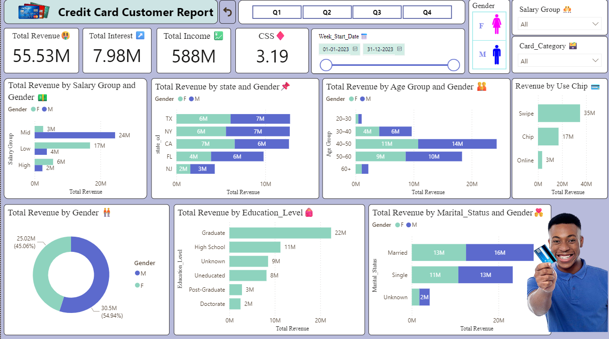

# 💳 Credit Card Users Data Analysis (Power BI)

## 📌 Project Overview

This project focuses on analyzing **credit card usage and transaction data** to uncover customer spending behavior, revenue trends, and key performance insights. The entire pipeline was built from **data transformation to interactive dashboards**, followed by publishing and app creation on **Power BI Service**.

---

## 🛠️ Project Workflow

1. **Data Preparation & Transformation**

   * Imported raw credit card transaction data.
   * Performed **data cleaning** (handling missing values, formatting dates, normalizing fields).
   * Applied **Power Query transformations** to ensure consistency and usability.

2. **Data Modeling**

   * Established relationships between **customer, transaction, and demographic tables**.
   * Created calculated columns and hierarchies for efficient analysis.
   * Designed a robust **data model** to support drill-downs and advanced reporting.

3. **Visualization & Dashboarding**

   * Built a **professional Power BI dashboard** with KPIs and insights such as:

     * Total Spending, Revenue, and Transactions
     * Customer Segmentation by Age, Gender, and Income Level
     * Spending Patterns by Category & Time (monthly/quarterly trends)
     * Credit Card Usage Behavior (active vs. inactive users)
   * Applied **DAX measures** for dynamic calculations (e.g., YoY growth, averages, percentages).
   * Designed an intuitive layout with modern visuals and filters for **self-service analytics**.

4. **Publishing & Power BI Service App**

   * Published the report to **Power BI Service**.
   * Created an **App** for easy sharing and collaboration.
   * Configured navigation, bookmarks, and user-friendly themes for a professional experience.

---

## 🚀 Key Insights

* Identified the **top spending categories** among credit card users.
* Discovered **high-value customer segments** driving the majority of revenue.
* Detected trends in **seasonal spending behavior** and recurring transactions.
* Helped design strategies for **customer retention and targeted marketing**.

---

## 🛠️ Tools & Technologies

* **Power BI Desktop** – Data transformation, modeling, and visualization
* **Power Query** – ETL and data cleaning
* **DAX** – Advanced calculations and measures
* **Power BI Service** – Report publishing, app creation, and sharing

---

## 📊 Dashboard Preview

*(Insert a screenshot of your dashboard here once uploaded)*

---

## 📂 Repository Structure

```
📁 Credit-Card-Users-Data-Analysis
 ┣ 📄 README.md                 → Project documentation  
 ┣ 📊 CreditCard_Report.pbix    → Power BI project file  
 ┣ 📑 Dataset.csv               → Raw dataset (if shareable)  
 ┗ 📸 Screenshots/              → Dashboard preview images  
```

---

## 🤝 Connect With Me

* 💼 [LinkedIn](http://www.linkedin.com/in/piyushkadam4)
* 📧 Email: [piyushkadam4484@gmail.com](mailto:piyushkadam4484@gmail.com)
